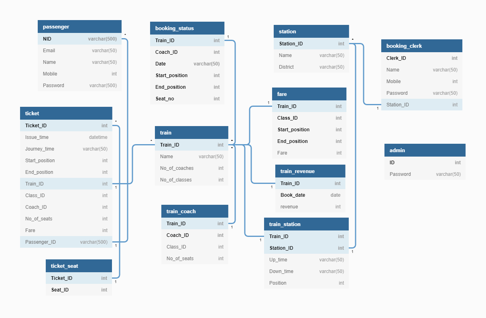

# DBMS Lab Project - Railway E-Ticketing Service
### Design of a fictional Railways Booking Service
### Find the repo at https://github.com/SukritBhatt/DBMS_Project.git

## Project Details

### Institute: [IIT Bhubaneswar](https://www.iitbbs.ac.in/)
### Course Instructor : [Dr. Padmalochan Bera](https://scholar.google.co.in/citations?user=_PJ8HK0AAAAJ&hl=en)

### The team:
- [Sukrit Bhatt](https://www.linkedin.com/in/sukritbhatt/)
- [Kushagra Gupta ](https://www.linkedin.com/in/kushagra-gupta-3827a4156/)
- [Satya Sangram Mishra](https://www.linkedin.com/in/satya-sangram/)

## Schema
# 
## Tools
### Front End
- [React](https://reactjs.org/)
    - A JavaScript library for building user interfaces
- [HTML, CSS, JavaScript](https://www.w3.org/)
    - W3C standard web-technologies for building, styling and designing web pages

### Back End
- [Node](https://nodejs.org/en/)
    - Node.js® is a JavaScript runtime built on Chrome's V8 JavaScript engine
- [Express](https://expressjs.com/)
    - Express is a minimal and flexible Node.js web application framework that provides a robust set of features for web and mobile applications
- [MySQL](https://www.mysql.com/)
    - MySQL is an open-source relational database management system
    - It is often integrated with other programs to implement applications that need relational database capability

## Features
- Login
    - Secure Login
    - Three types of users: Admin, Clerk, Passenger with varied functionalities available to them.
- Admin features
    - Add a new Station.
    - Add a new Train with coach and fare specifications.
    - Add route for the newly added train.
    - Add a clerk for a Station.
    - Get Revenue for a train for a particular date based on user bookings.
- Clerk features
    - Book a ticket on behalf of a passenger using email ID.
    - Check Trains based on From and To location.
    - Book Tickets based on Availability and Class Preference.
    - Print the Ticket.
- Passenger Features
    - Check Trains based on From and To location.
    - Book Tickets based on Availability and Class Preference.
    - Print the Ticket.
    - Acess to Dashboard to see All previous bookings.
    - Verify Ticket Status.
 - Non-Logged In User Features
    - Check Trains based on From and To location.
    - Verify Ticket Status.
    - Register as a new passenger.

## Usage
The project can be set up as follows:

0. Install Node.JS in your local machine
1. Clone this repository
2. `cd` into the project directory
3. Install npm packages inside both server and client folders
4. Setup mysql on your local machine
5. Login to the mysql session as a new root user. Create the required database by running the "database.sql" file provided in the repo
6. `cd` into the `server` folder; then run
    `node run devStart` to start the server
7. `cd` into the `client` folder; then run
    `node run start` to start the client
8. The site will load in your browser @ localhost:3000

**N.B. : The user credentials for MySQL, the database name and the PORT - all need to properly set as environment variables in a .env file